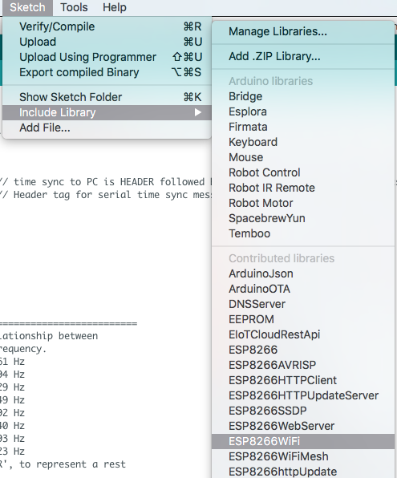

# Make a Heron Detector 
## To keep your beloved goldfish alive

The goal of this project is to make your goldfishes in the pond save from heron's. My grandma has a large pond and suffers from the presence of herons that eat her fish. Large goldfishes can be expensive so she tries everything to keep her fishes alive. Her husband already made a net to place over the pond. But since he passed away, she cannot manage to install the net on her own. Besides that, the net is ruining the beautifull view of the garden. 

  
The pond of my grandma

With this manual you can make your own Heron Detector. It's not only for heron's, you can also use the detector for cats or other animals wich are undesirable. 

## You need:
* A NodeMCU
* A buzzer
* A set of breadboard wires
* A Pir (motion) sensor
* A led and resistors

## Before we start

Before we start we need to configure our Arduino IDE for the NodeMCU:

###Step 1: add the [library for the NodeMCU](http://arduino.esp8266.com/versions/2.2.0/package_esp8266com_index.json)


###Step 2: install esp8266 package

Go to > Tools > Board > Boardmanager
Search for: 'esp'  
select this block:  
  
click install  

###Step 3: Configure settings
Configure your settings like this:  


Now you're all set and ready to go!

=========================================================

## Step 1: The Pir sensor

This is the pir sensor:
  
The pir sensor has 3 connections pins. VCC, OUT and GND. Connect the VCC to the Vin on your ESP, the OUT to the desired Digital output, i use D1, and the GND to the ground. 
  
The pir sensor gives a digital in/output, therefore we connect it to the D pins. When the pir sensor detects motion it returns a 1, if there is no motion it returns 0. 

To detect motion we use this code:

```javascript
// Declarations  
int pir = D1;
int pirState = LOW;
int val = 0;

void setup() {

  pinMode(pir, INPUT);

  Serial.begin(115200);
}

void powerOn(){
 	val = digitalRead(pir);
 
    if (val == HIGH) {
         
        if (pirState == LOW) {
           
           Serial.println("Motion detected!");
           pirState = HIGH;

        } else if (pirState == HIGH) {

             Serial.println("Motion ended");
             pirState = LOW;

        }
     } else {

       Serial.println("No motion detected!");

     }
     delay(2000);
}

void loop() {
	powerOn();
}
```
##Step 2: Sound and Light
We need something to scare the heron's away. We use light and sound to shoo them. Ofcourse this small buzzer used in this tutorial won't scare a big big heron away. But let's pretend this little buzzer is a 500 Watt speaker which blows the leaves of the tree's.

Connect the buzzer and the led to desired D pins. I used D3 for the buzzer and D4 for the led.
  

For the sound i used some code from the arduino playground, you can find this [here](https://www.arduino.cc/en/Tutorial/PlayMelody). To play the sound i made a new function called "playTone". The sound and light are triggered within the powerOn function. 

```javascript
// Declarations  
int pir = D1;
int led = D4;
int speakerOut = D3;
int pirState = LOW;
int val = 0;

// TONES  ==========================================
// Start by defining the relationship between 
//       note, period, &  frequency. 
#define  c     3830    // 261 Hz 
#define  d     3400    // 294 Hz 
#define  e     3038    // 329 Hz 
#define  f     2864    // 349 Hz 
#define  g     2550    // 392 Hz 
#define  a     2272    // 440 Hz 
#define  b     2028    // 493 Hz 
#define  C     1912    // 523 Hz 
// Define a special note, 'R', to represent a rest
#define  R     0

// Do we want debugging on serial out? 1 for yes, 0 for no
int DEBUG = 1;
// MELODY and TIMING  =======================================
//  melody[] is an array of notes, accompanied by beats[], 
//  which sets each note's relative length (higher #, longer note) 
//int melody[] = {  C,  b,  g,  C,  b,   e,  R,  C,  c,  g, a, C };
int melody[] = {  C,  b };
int beats[]  = { 16, 16, 16,  8,  8,  16, 32, 16, 16, 16, 8, 8 }; 
int MAX_COUNT = sizeof(melody) / 2; // Melody length, for looping.
// Set overall tempo
long tempo = 10000;
// Set length of pause between notes
int pause = 1000;
// Loop variable to increase Rest length
int rest_count = 100; //<-BLETCHEROUS HACK; See NOTES
// Initialize core variables

int tone_ = 0;
int beat = 0;
long duration  = 0;


void setup() {
  pinMode(speakerOut, OUTPUT);
  pinMode(led, OUTPUT);
  pinMode(pir, INPUT);

  Serial.begin(115200);
}

// PLay Tone
void playTone() {
 
 long elapsed_time = 0;
 if (tone_ > 0) { // if this isn't a Rest beat, while the tone has 
   //  played less long than 'duration', pulse speaker HIGH and LOW
   
   while (elapsed_time < duration) {
     digitalWrite(speakerOut,HIGH);
     delayMicroseconds(tone_ / 2);
     // DOWN
     digitalWrite(speakerOut, LOW);
     delayMicroseconds(tone_ / 2);
     // Keep track of how long we pulsed
     elapsed_time += (tone_);
   } 
 }
 else { // Rest beat; loop times delay
   for (int j = 0; j < rest_count; j++) { // See NOTE on rest_count
     delayMicroseconds(duration);  
   }                                
 }                                 
}

void powerOn(){
  val = digitalRead(pir);
     
     if (val == HIGH) {
         if (pirState == LOW) {
           Serial.println("Motion detected!");
           digitalWrite(led, HIGH);
 
           pirState = HIGH;
           for (int i=0; i<MAX_COUNT; i++) {
             tone_ = melody[i];
             beat = beats[i];
         
             duration = beat * tempo; // Set up timing
         
             playTone(); 
             // A pause between notes...
             delayMicroseconds(pause);
         
             if (DEBUG) { // If debugging, report loop, tone, beat, and duration
               Serial.print(i);
               Serial.print(":");
               Serial.print(beat);
               Serial.print(" ");    
               Serial.print(tone_);
               Serial.print(" ");
               Serial.println(duration);
             }
           }
         } else if (pirState == HIGH) {
             digitalWrite(led, LOW);
             Serial.println("Motion ended");
             pirState = LOW;
           }
     } else {
       Serial.println("No motion detected!");
       digitalWrite(led, LOW);
     }
     delay(2000);
}

void loop() {
	powerOn();
}

```

##Step 3: WiFi Connection

To make a user interface where you can control the detector and see the history we need to connect the ESP with the internet. You need a WiFi network to connect to or you can use a hotspot from your smartphone. At the begin of this tutorial you installed the esp8266 package. With this package comes a few librarys. For the WiFi connection we need the ESP8266WiFi library, you can find this at sketch > include library > ESP8266WiFi


You need to include this library at the beginning of your code:

```javascript
// Include 
#include <ESP8266WiFi.h>

```

Set the settings for the WiFi connection:
```javascript
const char* ssid     = "***********"; // Fill in your own SSID.
const char* password = "***********"; // Fill in your password.


// setup
void setup() {
  pinMode(speakerOut, OUTPUT);
  pinMode(led, OUTPUT);
  pinMode(pir, INPUT);

  Serial.begin(115200);
  
  delay(10);
 
  Serial.print("Connecting to ");
  Serial.println(ssid);
  
  WiFi.begin(ssid, password);
  int wifi_ctr = 0;
  while (WiFi.status() != WL_CONNECTED) {
      delay(500);
      Serial.print(".");
  }
  
  Serial.println("WiFi connected");
  Serial.println("IP address: " + WiFi.localIP());
}

```

##Step 4: Send data to the dashboard whenever the pir sensor detects motion

To see the history of the detected motion we need to send the data to a .txt file. This .txt file lives on your server. I called mine motion.txt.
With a POST request the data will be send to the .txt file.

The arduino code:  
```javascript

void sendMotionValue(int value){

  WiFiClient client;
  int contentLength = String(value).length() + 7;

    if (client.connect("tomsnepvangers.com", 80)) {
    Serial.println("connected");
    client.println("POST /IoT/motion.php HTTP/1.1");
    client.println("Host: tomsnepvangers.com");
    client.println("Content-Type: application/x-www-form-urlencoded");
    client.print("Content-Length: ");
    client.println(contentLength);
    client.println();
    client.print("motion=");
    client.println(value);
  } else {
    Serial.println("connection failed");
  }
}
```

On the server we have a file called motion.php. This piece of code places the date and time in a text file when motion is detected:
```javascript
<?php
    $motion = $_POST['motion'];
    
    $filename1 = 'motion.txt';

    $timestamp = new DateTime();
    $time = $timestamp->format("Y-m-d");


    $file_data1 = $time . "\r\n";
    $file_data1 .= file_get_contents($filename1);
    file_put_contents($filename1, $file_data1);

?>

```

Now you will have a .txt file of the history from how many times motion is detected by day.

##Step 5: Add an on off switch for the detector

At some points, you don't want the detector to make noise and ligth. For example when you are in garden yourself and there is no need to detect hero's. Therefore we make a on/off switch to shut the detector down.

In the dashboard we make two buttons (on and off). The value of these buttons is stored in a json file, switch.json for example. The NodeMCU does a get request to this switch.json to read the state. To read json we need to include the library ArduinoJson, you can find this library in sketch > include library > manage libraries > search ArduinoJson. Everytime the NodeMCU connects to the internet, it reads the json file:

```javascript
//Include
#include <ArduinoJson.h>

void onOffSwitch() {
  Serial.print(hour());
  Serial.print("connecting to ");
  Serial.println(host);
  WiFiClient client;
  const int httpPort = 80;
  if (!client.connect(host, httpPort)) {
    Serial.println("connection failed");
    return;
  }

  client.print(String("GET ") + path + " HTTP/1.1\r\n" +
               "Host: " + host + "\r\n" +
               "Connection: keep-alive\r\n\r\n");

  delay(500); // wait for server to respond

  // read response
  String section = "header";
  while (client.available()) {
    String line = client.readStringUntil('\r');
    // Serial.print(line);
    // we'll parse the HTML body here
    if (section == "header") { // headers..
      Serial.print(".");
      if (line == "\n") { // skips the empty space at the beginning
        section = "json";
      }
    }
    else if (section == "json") { // print the good stuff
      section = "ignore";
      String result = line.substring(1);

      // Parse JSON
      int size = result.length() + 2;
      char json[size];
      result.toCharArray(json, size);
      StaticJsonBuffer<200> jsonBuffer;
      JsonObject& json_parsed = jsonBuffer.parseObject(json);
      if (!json_parsed.success())
      {
        Serial.println("parseObject() failed");
        return;
      }

      // Make the decision to turn off or on the LED
      if (strcmp(json_parsed["switch"], "on") == 0) {
        Serial.println("Switch is on");
        powerOn();
      }
      else {
        Serial.println("Switch is off");
      }
    }
  }
  Serial.print("closing connection. ");
}

void loop() {
	onOffSwitch();
}
```

You can see that a few things are changed compared to the previous steps. Now the onOffSwitch() functions is called from the loop. This is how the NodeMCU continuously keeps checking of the detector needs to be on or off.
When the value is "on" the function powerOn() is fired wich we already have declared in the previous steps. 

##Final result

So with all these steps together your Arduino code should look something like this:
```javascript
// Include 
#include <ESP8266WiFi.h>
#include <ArduinoJson.h>
#include <ESP8266HTTPClient.h>

// Declarations  
int pir = D1;
int led = D4;
int speakerOut = D3;
int pirState = LOW;
int val = 0;

// TONES  ==========================================
// Start by defining the relationship between 
//       note, period, &  frequency. 
#define  c     3830    // 261 Hz 
#define  d     3400    // 294 Hz 
#define  e     3038    // 329 Hz 
#define  f     2864    // 349 Hz 
#define  g     2550    // 392 Hz 
#define  a     2272    // 440 Hz 
#define  b     2028    // 493 Hz 
#define  C     1912    // 523 Hz 
// Define a special note, 'R', to represent a rest
#define  R     0

// Do we want debugging on serial out? 1 for yes, 0 for no
int DEBUG = 1;
// MELODY and TIMING  =======================================
//  melody[] is an array of notes, accompanied by beats[], 
//  which sets each note's relative length (higher #, longer note) 
//int melody[] = {  C,  b,  g,  C,  b,   e,  R,  C,  c,  g, a, C };
int melody[] = {  C,  b };
int beats[]  = { 16, 16, 16,  8,  8,  16, 32, 16, 16, 16, 8, 8 }; 
int MAX_COUNT = sizeof(melody) / 2; // Melody length, for looping.
// Set overall tempo
long tempo = 10000;
// Set length of pause between notes
int pause = 1000;
// Loop variable to increase Rest length
int rest_count = 100; //<-BLETCHEROUS HACK; See NOTES

// Initialize core variables
int tone_ = 0;
int beat = 0;
long duration  = 0;

int power = false;
const char* host     = "tomsnepvangers.com"; // Your domain
String path          = "/IoT/switch.json";

const char* ssid     = "iPhone van Tom"; // Fill in your own SSID.
const char* password = "snepvangers"; // Fill in your password.


// setup
void setup() {
  pinMode(speakerOut, OUTPUT);
  pinMode(led, OUTPUT);
  pinMode(pir, INPUT);

  Serial.begin(115200);
  
  delay(10);
 
  Serial.print("Connecting to ");
  Serial.println(ssid);
  
  WiFi.begin(ssid, password);
  int wifi_ctr = 0;
  while (WiFi.status() != WL_CONNECTED) {
      delay(500);
      Serial.print(".");
  }
  
  Serial.println("WiFi connected");
  Serial.println("IP address: " + WiFi.localIP());
}

void sendMotionValue(int value){

  WiFiClient client;
  int contentLength = String(value).length() + 7;

    if (client.connect("tomsnepvangers.com", 80)) {
    Serial.println("connected");
    client.println("POST /IoT/motion.php HTTP/1.1");
    client.println("Host: tomsnepvangers.com");
    client.println("Content-Type: application/x-www-form-urlencoded");
    client.print("Content-Length: ");
    client.println(contentLength);
    client.println();
    client.print("motion=");
    client.println(value);
  } else {
    Serial.println("connection failed");
  }
}

void onOffSwitch() {
  Serial.print(hour());
  Serial.print("connecting to ");
  Serial.println(host);
  WiFiClient client;
  const int httpPort = 80;
  if (!client.connect(host, httpPort)) {
    Serial.println("connection failed");
    return;
  }

  client.print(String("GET ") + path + " HTTP/1.1\r\n" +
               "Host: " + host + "\r\n" +
               "Connection: keep-alive\r\n\r\n");

  delay(500); // wait for server to respond

  // read response
  String section = "header";
  while (client.available()) {
    String line = client.readStringUntil('\r');
    // Serial.print(line);
    // we'll parse the HTML body here
    if (section == "header") { // headers..
      Serial.print(".");
      if (line == "\n") { // skips the empty space at the beginning
        section = "json";
      }
    }
    else if (section == "json") { // print the good stuff
      section = "ignore";
      String result = line.substring(1);

      // Parse JSON
      int size = result.length() + 2;
      char json[size];
      result.toCharArray(json, size);
      StaticJsonBuffer<200> jsonBuffer;
      JsonObject& json_parsed = jsonBuffer.parseObject(json);
      if (!json_parsed.success())
      {
        Serial.println("parseObject() failed");
        return;
      }

      // Make the decision to turn off or on the LED
      if (strcmp(json_parsed["switch"], "on") == 0) {
        Serial.println("Switch is on");
        powerOn();
      }
      else {
        Serial.println("Switch is off");
      }
    }
  }
  Serial.print("closing connection. ");
}

// PLay Tone
void playTone() {
 
 long elapsed_time = 0;
 if (tone_ > 0) { // if this isn't a Rest beat, while the tone has 
   //  played less long than 'duration', pulse speaker HIGH and LOW
   
   while (elapsed_time < duration) {
     digitalWrite(speakerOut,HIGH);
     delayMicroseconds(tone_ / 2);
     // DOWN
     digitalWrite(speakerOut, LOW);
     delayMicroseconds(tone_ / 2);
     // Keep track of how long we pulsed
     elapsed_time += (tone_);
   } 
 }
 else { // Rest beat; loop times delay
   for (int j = 0; j < rest_count; j++) { // See NOTE on rest_count
     delayMicroseconds(duration);  
   }                                
 }                                 
}

void powerOn(){
  val = digitalRead(pir);
     Serial.println(digitalRead(pir));
     if (val == HIGH) {
         if (pirState == LOW) {
           Serial.println("Motion detected!");
           digitalWrite(led, HIGH);
           sendMotionValue(1);
           pirState = HIGH;
           for (int i=0; i<MAX_COUNT; i++) {
             tone_ = melody[i];
             beat = beats[i];
         
             duration = beat * tempo; // Set up timing
         
             playTone(); 
             // A pause between notes...
             delayMicroseconds(pause);
         
             if (DEBUG) { // If debugging, report loop, tone, beat, and duration
               Serial.print(i);
               Serial.print(":");
               Serial.print(beat);
               Serial.print(" ");    
               Serial.print(tone_);
               Serial.print(" ");
               Serial.println(duration);
             }
           }
         } else if (pirState == HIGH) {
             digitalWrite(led, LOW);
             Serial.println("Motion ended");
             pirState = LOW;
           }
     } else {
       Serial.println("No motion detected!");
       digitalWrite(led, LOW);
     }
     delay(2000);
}


void loop() {
  onOffSwitch();
}
```

The code on the server can look something like this, i wrapped al the code in one file right now. Included the PHP and Javascript:
```javascript
<?php
    $motion = $_POST['motion'];
    
    $filename1 = 'motion.txt';

    $timestamp = new DateTime();
    $time = $timestamp->format("Y-m-d");


    $file_data1 = $time . "\r\n";
    $file_data1 .= file_get_contents($filename1);
    file_put_contents($filename1, $file_data1);

?>

<?php
    $switch = $_POST['switch'];
    
    $filename = 'switch.json';
    
    $file = fopen('switch.json', 'w');
    fwrite($file, '{"switch": "' . $switch . '"}');
    fclose($file);
?>


<html>
    <head>
        <meta charset="utf-8">
        <meta http-equiv="X-UA-Compatible" content="IE=edge">
        <meta name="viewport" content="width=device-width, initial-scale=1">
​		<meta http-equiv="refresh" content="30">
        <title>Reiger detector</title>
​		<script type="text/javascript" src="https://cdnjs.cloudflare.com/ajax/libs/Chart.js/1.0.2/Chart.js"></script>
        <script src="https://ajax.googleapis.com/ajax/libs/jquery/2.2.0/jquery.min.js"></script>        
        <style>
        ...
        </style>
    </head>
    
    <body>

    	<header>
    		<h1>Reiger detector</h1>
    	</header>
		
		<div class="img-container">
	    	
		</div>

        <section id="buttonSection">
            <div class="row">
      			<p class="detector-state">De reiger detector staat <span class="state-value"></span></p>
                <div class="col-md-12">
                <a href="#" class="js-off button">Schakel detector uit</a>
                <a href="#" class="js-on button" >Schakel detector aan</a>
                </div>
            </div>       
        </section>

        <section id="history">

        	
        </section>
  
        <script src="script.js"></script>
    </body>
</html>

<script src="script.js">
(function() {
    var $on = $('.js-on');
    var $off = $('.js-off');
    var date;
    var count = {};
    var detectorState = document.querySelector('.detector-state');
    var stateEl = document.querySelector('.state-value');
    var buttons = document.querySelectorAll('.button');
    
    checkState();
    
    $on.on('click', function(e) {
        e.preventDefault();
                
        $.ajax({
            type: 'POST',
            url: 'http://tomsnepvangers.com/IoT/switch.php',
            data: { switch: 'on' }
        });

         $.when( $.ajax( "http://tomsnepvangers.com/IoT/switch.php" ) ).done(function( x ) {
        
            checkState();
        });

    });
    
    $off.on('click', function(e) {
        e.preventDefault(); 
        
        $.ajax({
            type: 'POST',
            url: 'http://tomsnepvangers.com/IoT/switch.php',
            data: {  switch: 'off' }
        });

        $.when( $.ajax( "http://tomsnepvangers.com/IoT/switch.php" ) ).done(function( x ) {
        
            checkState();
        });

    });

     $.ajax({
             url:'motion.txt',
             success: function (data) {
               var data = data;
             }
            });

    function checkState() {

        $.ajax({
            url: 'switch.json',
            success: function(data) {

                if(data.switch == "on"){

                    stateEl.innerHTML = "aan";

                } else if (data.switch == "off") {

                    stateEl.innerHTML = "uit";
                } else {
                    
                    detectorState.innerHTML = "Er is iets mis met de reiger detector";
                }
            }
        });
    };

    $.ajax({
     url:'motion.txt',
     success: function (data) {

        date = data.toString().split("\n");

        date.pop();

        date.forEach(function(i) { count[i] = (count[i]|| 0)+1;  });
            
     }
    });

    $.when( $.ajax( "motion.txt" ) ).done(function( x ) {
        renderHistory();
    });

    function renderHistory() {
        var keys = Object.keys(count);
        var section = document.getElementById('history');

        for (var i = 0; i < keys.length; i++) {
            var key = keys[i];
            var val = count[keys[i]];
            console.log(key);
            console.log(val);

            var elDiv = document.createElement('div');

            var calendar = document.createElement('img');
            var heron = document.createElement('img');

            calendar.setAttribute('src', 'calendar.png');
            heron.setAttribute('src', 'reiger.png');

            var elDate = document.createElement('p');
            var elValue = document.createElement('p');

            var date = document.createTextNode(key);
            var value = document.createTextNode(val);

            elDate.appendChild(date);
            elValue.appendChild(value);

            elDiv.appendChild(calendar);
            elDiv.appendChild(elDate);
            elDiv.appendChild(heron);
            elDiv.appendChild(elValue);

            section.appendChild(elDiv);
        }
    }
}())
</script>
```

##The end
Thankyou for reading this tutorial. I'll hope you enjoyed reading it. You can see the dashboard in live action on this [url](http://www.tomsnepvangers.com/IoT).
Cheers!

